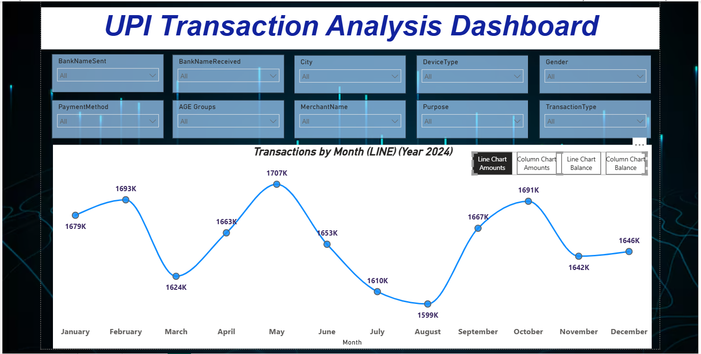
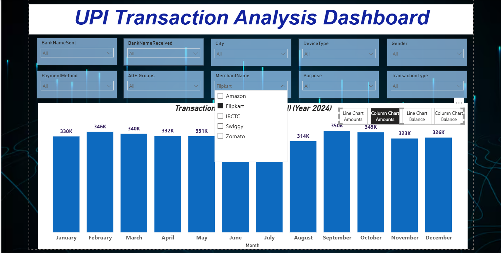
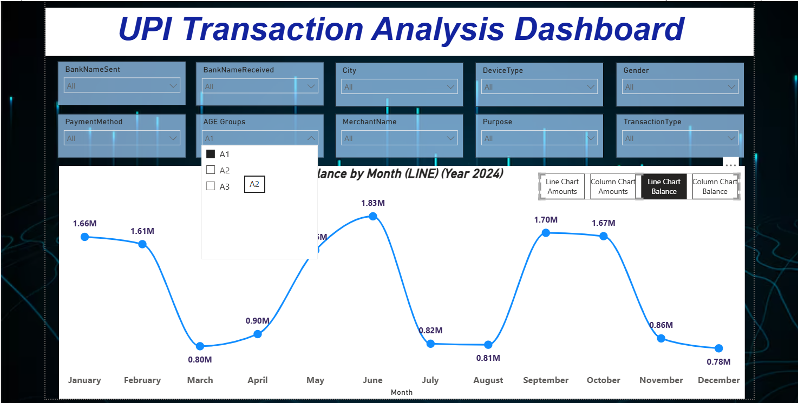
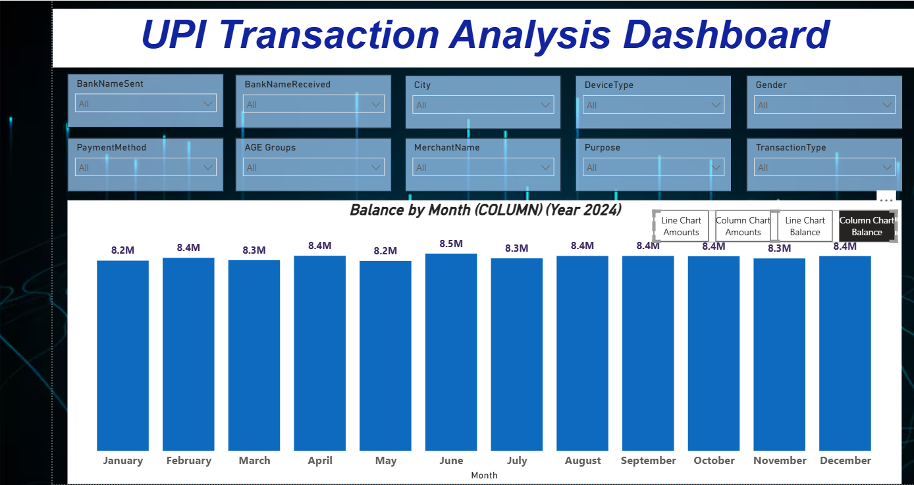

## UPI Transaction Analysis Dashboard

## 📊 Project Overview

This project presents an interactive **UPI Transaction Analysis Dashboard** created using **Microsoft Power BI**.

The dashboard is designed to analyze UPI transaction data and present it through interactive visualizations, filters, and navigation features.

A key focus of this project is the use of **Power BI Bookmarks** to create a smooth and user-friendly navigation experience between different dashboard views.

---

## 🎯 Project Objectives

- Analyze UPI transaction data using Power BI
- Create interactive and meaningful visualizations
- Explore transaction patterns across different categories
- Use filters and slicers for interactive analysis
- Implement **Bookmarks for navigation and view switching**
- Improve dashboard usability through navigation buttons
- Present data in a clean and easy-to-understand format

---

## 🛠️ Tools & Technologies

- **Microsoft Power BI**
- **Microsoft Excel**
- **Power BI Bookmarks**
- **Power BI Slicers**
- **Power BI Navigation Buttons**

---

## 📁 Dataset

The dataset used for this project contains UPI transaction information.

Some of the major fields include:

- Transaction Date
- Transaction Amount
- Remaining Balance
- Bank Name
- City
- Transaction Type
- Payment Method
- Merchant Name
- Purpose
- Currency
- Device Type
- Gender
- Age Group

The dataset was used to create different visual perspectives of UPI transactions.

---

## 📈 Dashboard Features

The dashboard includes interactive visualizations for exploring:

- Transaction trends
- Transaction amounts
- Remaining balance
- Bank-wise analysis
- City-wise analysis
- Merchant analysis
- Payment methods
- Transaction types
- Device types
- Customer demographics

Users can interact with the dashboard using filters and slicers.

---

## 🔖 Power BI Bookmarks

One of the main features of this project is the use of **Power BI Bookmarks**.

Bookmarks were used to create different dashboard views and allow users to switch between them using navigation buttons.

This helped me:

- Create a smoother navigation experience
- Switch between different visual views
- Reduce the need for multiple report pages
- Make the dashboard more interactive
- Improve the overall user experience

The implementation of Bookmarks was one of the key learning outcomes of this project.

---

## 📊 Dashboard Design

The dashboard was designed with a focus on:

- Clean layout
- Interactive navigation
- Easy data exploration
- Meaningful visualizations
- User-friendly experience

---

## 🎓 Key Learning

Through this project, I learned that an effective Power BI dashboard is not only about creating charts and visuals.

Good dashboard design also involves:

**Data → Visualization → Interaction → Navigation → User Experience**

Working with **Bookmarks and navigation buttons** helped me understand how Power BI can be used to create more interactive and engaging reports.

---

## 📸 Dashboard Preview

### 1. Dashboard Overview

### 2. Transaction Analysis

### 3. Balance Analysis

### 4. Detailed Analysis

---

## 🚀 Future Improvements

Possible future improvements include:

- Adding more advanced DAX measures
- Adding KPI cards
- Improving dashboard storytelling
- Adding more interactive navigation
- Implementing advanced analytics
- Adding additional transaction trends and comparisons

---

## 👨‍💻 Project Created By

**Bhawna Bhardwaj**

Created under the guidance of **[Sajjad Mir]**.

---

## ⭐ Acknowledgement

Special thanks to my instructor for the guidance and support throughout this project.

---

#PowerBI #DataAnalytics #DataVisualization #BusinessIntelligence #UPI #Dashboard #Bookmarks
